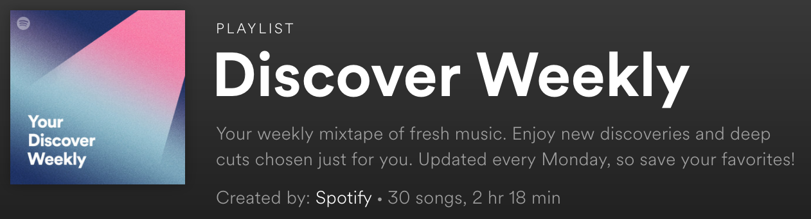
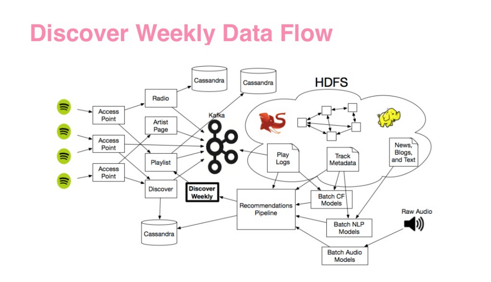

```{r setup, include=FALSE}
knitr::opts_chunk$set(echo = TRUE)
```

### Spotify

Spotify[^1] is a music streaming service in the same vein as Apple Music, Tidal, or Pandora. It has a sizable catalog of music available for on-demand streaming, and provides premium accounts for those who wish to have added features like an ad-free experience. At over 80 million subscribers[^2] its one of the (if not *the*) most popular services of its kind.

#### Discover Weekly 

One of the features I (and many, many other subscribers) really like about Spotify is their uncanny ability to know what other music you like. This is reflected in a feature known as "Discover Weekly", a special playlist personalized to your tastes that Spotify compiles every Monday for its users.



In order to make the magic happen, Spotify uses not one but three different algorithms to match users with music they may like. This ensemble technique includes: collaborative filtering (to compare you to similar users), neural networks (on the actual audio), and a version of natural language text processing (on the playlist)[^3].

Considering how popular Spotify is, how many users they have, and the size of their catalog, there is certainly no lack of data available to use in these types of algorithms.



#### Improving on the Formula

Despite it's popularity and uncanny accuracy, can Discover Weekly be improved? Some people seem to think so. One user, for example, wrote an app to allow users the ability to tweak the settings of their recommendations[^4].

Personally, I'd like to see the ability to tailor which parts of songs I like and play often are factored into the algorithm. For example, I can say that I like a particular song mainly because of the vocals, or perhaps the specific lyrics mean something to me, or maybe it's just the beat. That level of subclassification could allow Spotify to get really specific about how it recommends new music to its users.

#### What's Next?

Streaming music is a competitive business, so it will not do to rest upon one's laurels. One interesting potential direction that Spotify seems to be moving in is leveraging their recommendation algorithms in other general playlists to tailor them to the user[^5]. So, one day the "Metal Ballads" playlist you listen to would differ from the one that I hear.


[^1]: https://www.spotify.com/us/about-us/contact/
[^2]: https://www.statista.com/statistics/244995/number-of-paying-spotify-subscribers/
[^3]: https://medium.com/s/story/spotifys-discover-weekly-how-machine-learning-finds-your-new-music-19a41ab76efe
[^4]: https://www.theverge.com/tldr/2018/2/5/16974194/spotify-recommendation-algorithm-playlist-hack-nelson
[^5]: https://www.digitalmusicnews.com/2018/09/23/spotify-personalization-playlists/
