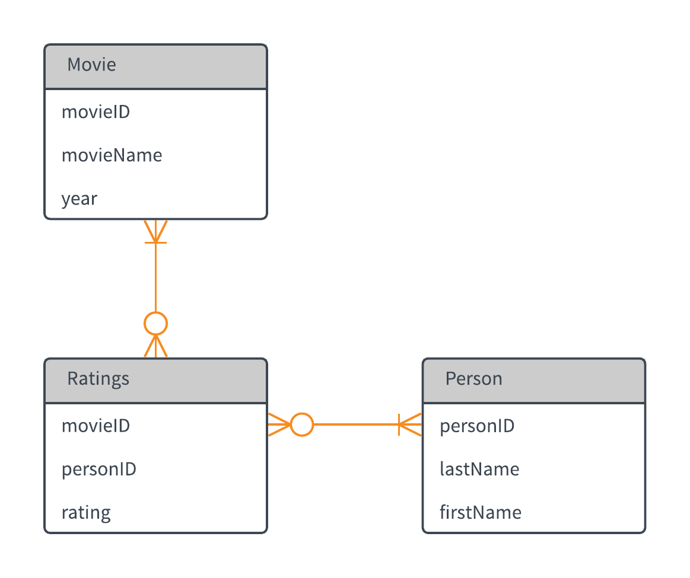

---
params:
  password: Tigger-7725
output:
  pdf_document: default
  html_document: default
---
<style>
blockquote
{
  font-size: 9pt;
}

img
{
  width: 60%;
  height: 60%;
}

h2
{
  text-decoration: underline;
}

</style>
---
title: "Week 2 Assignment"
author: "Adam Douglas"
date: "9/7/2018"
output: html_document
---

```{r setup, include=FALSE}
knitr::opts_chunk$set(echo = TRUE)
knitr::opts_chunk$set(message = FALSE)

library(tidyverse)
library(RColorBrewer)
```

## The Database

We begin by creating a database to store our movies, raters, and ratings in. For this exercise, I have chosen PostgreSQL. Not only is it a popular open source choice and a robust DBMS, but it is also one of the DBMS I have not used yet so I wanted to give it a try.

### The Structure

The structure of the database will be simple enough. One table with movies in it, one with people who see one or more of the movies, and an associative table with each person's ratings. Below is a basic ER diagram outlining the general structure:
```{r}

```

### The Code

Once we have our structure set, we begin creating the tables themselves. The code used to create the tables in the PostgreSQL database system and load the data into them is included in a separate file called `Assignment 2.sql`. To give an idea of what the structure looks like from a code perspective, below are the table creation statements used:

>CREATE TABLE public.movies
(
    "movieID" integer NOT NULL,
    "movieName" character varying(200), 
    year integer, 
    CONSTRAINT movies_pkey PRIMARY KEY ("movieID"))

>CREATE TABLE public.person
(
    "personID" integer NOT NULL,
    "lastName" character varying(20),
    "firstName" character varying(40),
    CONSTRAINT person_pkey PRIMARY KEY ("personID")
)

>CREATE TABLE public.ratings
(
    "movieID" integer,
    "personID" integer,
    rating integer,
    PRIMARY KEY ("movieID", "personID"),
    CONSTRAINT fk_movie FOREIGN KEY ("movieID")
        REFERENCES public.movies ("movieID"),
    CONSTRAINT fk_person FOREIGN KEY ("personID")
        REFERENCES public.person ("personID"),
    CONSTRAINT ck_rating CHECK (rating >= 1 AND rating <= 5)
)

Note that the ratings table has a few constraints on it. First it uses foreign keys to ensure that any `movieID` or `personID` put into it has a match in their respective tables. Also, we use a check constraint to ensure that ratings are from 1 - 5 stars.

***

## The Data
Now that we have the data loaded into our database, we will need to query it to do any kind of analysis. We begin by loading the package we'll use to connect to the PostgreSQL database and setting up some basic variables with information about the database itself (such as user, password, what port it is running on, etc.):

```{r}
# Load the package to connect
library(RPostgreSQL)

# Variables to create the connection
host <- "localhost"
usr <- "postgres"
pass <- params$password
port <- 5432
database <- "movies"
```

Now we create the actual driver and connection:

```{r}
# Creates the actual connection object
conn <- dbConnect(RPostgreSQL::PostgreSQL(),host = host, dbname = database, user = usr, password = pass)
```

Now that we have the connection object, let's test to make sure it works:

```{r}
# A test SQL query
testSQL <- dbSendQuery(conn, "select count(*) from public.movies")

# Retreive the results
test <- dbFetch(testSQL)
```

We see from the results that we have `r test` records in the `movies` table, which is what we expect.

Now, we will aquire the data. Rather than writing a single query combining the tables, I'm going to pull each one into its own object and work with them within R. I am doing this for two reasons:

1. I am not sure yet what sort of analysis I want to perform on the data. If I have the data as a result of a SQL statement, I need to decide what I want when I execute that SQL. This way I can adapt as I go by filtering the data in its raw form within R.

2. It gives me an opportunity to work with `dplyr` and other tools to format and tidy data.

```{r}
# Get the movies
movieSQL <- dbSendQuery(conn, "select * from public.movies")
movies <- dbFetch(movieSQL)
# Get the people
personSQL <- dbSendQuery(conn, "select * from public.person")
person <- dbFetch(personSQL)
# Get the ratings
ratingsSQL <- dbSendQuery(conn, "select * from public.ratings")
ratings <- dbFetch(ratingsSQL)
```

Now that we have our data, we can close the database connection:

```{r results='hide'}
dbDisconnect(conn)
```

***

## The Analysis

First let's look at the data we've gathered:

```{r}
str(movies)
str(person)
str(ratings)
```

We have both int variables and character variables, which is what we expected from the database.

First, let's look at who is doing how many ratings. Before we can answer this, and other, questions, we need to combine these datasets into a single tidy dataset. We will do this by using joining functions courtesy of the `dplyr` package, which is part of the Tidyverse set of packages; the syntax is similar to SQL.

Let's look at everyone's ratings, regardless of the movie:

```{r}
# We combine the datasets and select only the fields we want
ratingsByPerson <- movies %>% left_join(ratings, by="movieID") %>% inner_join(person, by="personID") %>% select(firstName, rating)

glimpse(ratingsByPerson)
```

```{r}
ggplot(ratingsByPerson, aes(rating, fill=firstName)) + geom_bar() + scale_y_continuous(breaks=seq(0,10,2)) + labs(title="Ratings by Person", x="Rating", y="Count", fill="Person")
```

Looking at the distribution of ratings, it appears that I (Adam) tend to rate high (only 4's or 5's) and my wife (April) tends to rate more evenly across the 3-4 range. Perhaps I need to choose the movies less often.

Now let's look at how individual movies fared overall:

```{r}
# Like before, we combine the datasets and select only the fields we want
ratingsByMovie <- movies %>% left_join(ratings, by="movieID") %>% select(movieName, rating)

glimpse(ratingsByMovie)
```

Let's get a sense of how the movies fared in terms of typical ratings:

```{r}
ratingsByMovie %>% group_by(movieName) %>% summarize(AvgRating = mean(rating), NumRatings = n()) %>% arrange(desc(AvgRating),movieName)
```

"Avengers: Infinity War", "Crazy Rich Asians", and "Three Billboards Outside Ebbing, Missouri" are the most popular when one looks at mean ratings. The Mr. Roger's documentary "Won't You Be My Neighbor" had the most appeal amongst the family, as it had the largest number of ratings overall (and got a 4.2 mean rating!).

Finally, let's look at how each person rated each individual movie:

```{r}
# Once again, we select just what we need
ratingsByMovieByPerson <- movies %>% left_join(ratings, by="movieID") %>% inner_join(person, by="personID") %>% select(movieName, firstName, rating)

glimpse(ratingsByMovieByPerson)
```

Let's take a numerical look at "Avengers: Infinity War", as an example:

```{r}
ratingsByMovieByPerson %>% filter(movieName == "Avengers: Infinity War")
```
Three people rated the movie, and overall it was rated very well.

However, rather than look at each one individually, we can visualize the ratings by person and movie in one graphic:

```{r}
ggplot(ratingsByMovieByPerson, aes(firstName, movieName)) + geom_tile(aes(fill=as.factor(rating))) + scale_fill_brewer(name="Rating",palette="RdYlGn") + geom_text(aes(label=rating)) + guides(fill=FALSE) + labs(title="Movie Ratings by Person", x="", y="")
```

***
