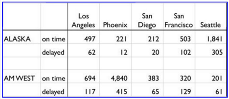

```{r setup, include=FALSE}
knitr::opts_chunk$set(echo = TRUE)
library(tidyverse)
```

## Loading the Data
First we load the CSV file by using the `read_csv` function from the `readr` package. The CSV file was created by copying exactly what was presented in the assignment PDF (shown below). This includes missing fields, blank lines, and all.



```{r read csv, warning=FALSE, message=FALSE}
rawdata <- read_csv("week5.csv",col_names=TRUE)

rawdata
```

Looking at what was read into R, we see a few different issues with our raw data:

1. Missing column names (which were assigned unintuitive names of X1 and X2)
2. Observations that are entirely blank
3. Missing values in the first column

We'll take each of these in turn in the next section and show how we can correct them.

## Data Cleansing

### Missing Column Names
First we tackel the two columns that are missing names. This is relatively easy to correct thanks to the `dplyr` package and the `rename` function:

```{r missing column names}
rawdata <- rename(rawdata, airline = X1, status = X2)

rawdata
```

Now every column has a meaningful name. Note that the city names are non-standard (they have spaces). We could correct them as well, but when we begin to tidy the data having them with their original names will be useful.

### Blank Observations
We had a blank row in our source file, so it stands to reason that we'd have a blank row in our data after input. To remove this empty observation, we can use the `filter` function in `dplyr`. By looking for observations without a blank status column, we can keep only complete rows.

```{r blank row}
rawdata <- rawdata %>% filter(!is.na(status))

rawdata
```
### Missing Airlines
Finally, because the table the data came from was formatted such that the airline wasn't labeled on each line, we have NAs in that column as well. These are also rectified quite easily by using the `fill` function, which is from the `tidyr` package.

```{r missing airline}
rawdata <- fill(rawdata,airline)

rawdata
```

Now we have a more complete and clean data set. Our next step will be to tidy it.

## Tidying Data
By putting our data into a "tidy" format, we make analysis within R easier to do.

The largest issue with our raw data is that each city is an observation, yet it is stored in separate columns, like variables. What we need to do is bring these columns down into rows.

We use the `gather` function from `tidyr` to do rearrange our data. We pass it the names of the columns we need to gather into observations (here, the city columns), the "key" or name of the new column with the gathered values, and a name for the new value column (called "flights" here):

```{r tidying}
tidydata <- rawdata %>% gather(`Los Angeles`,Phoenix,`San Diego`,`San Francisco`,Seattle, key="city", value="flights")

tidydata
```

Now, each city is an observation as it ought to be.

We also have the reverse problem with variables listed as observations, namely the status column. We need to move these into columns by using the `tidyr` package and the `spread` function.

```{r}
# Since the "on-time" value gives us a non-standard column name, we change it with rename.

tidydata <- spread(tidydata,key=status, value=flights) %>% rename(on_time = `on-time`)

tidydata
```

Now the two variables (delayed flights, and on-time flights) are in their proper place in the columns. OUr data set is now tidy.

## Analysis
Now that our data is in a tidy format, our analysis can proceed.

First, we'll look at each airline's service into each airport:

```{r by city and airline}
# Total flights by city and airline
totalByCity <- tidydata %>%
  group_by(airline, city) %>%
  summarize(total_flights = delayed + on_time)

# Plot
ggplot(totalByCity, aes(x=city, y=total_flights, fill=airline)) +
  geom_col(position="dodge") + ggtitle("Flights by City and Airline") +
  xlab("City") + ylab("# Flights")
```

As expected, each airline does not have the same number of flights coming into the same city, so we cannot compare the delays with raw counts. Instead we need a ratio for each.

```{r}
# Delay ratio by city and airline
delayByCity <- tidydata %>% 
  mutate(totalFlights = delayed + on_time, delayRatio = delayed/totalFlights) %>%
  group_by(airline, city) %>%
  summarize(delay = mean(delayRatio))

# Plot
ggplot(delayByCity, aes(x=city, y=delay, fill=airline)) +
  geom_col(position="dodge") + ggtitle("Delay Ratio by City and Airline") +
  xlab("City") + ylab("# Flights") + labs(fill="Airline")

```

Looking at the graph, we can quickly see that AM WEST has a higher ratio of delayed flights to total flights in every city they fly to, when compared to Alaska Airlines. In some cases, the difference is slight (Seattle) while in others it is significant (San Francisco).